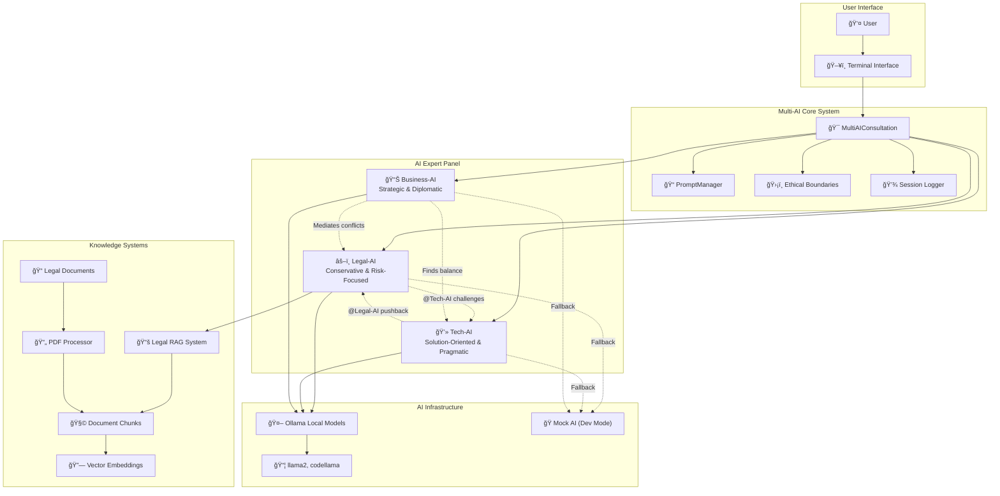

# 🯠Multi-AI Consultation System

A terminal-based multi-AI consultation room where specialized AI assistants discuss problems from their expert perspectives, helping you make informed decisions through real-time AI-to-AI debates.

## 🤖 Meet Your AI Expert Panel

### âš–ï¸ Legal-AI
- **Personality**: Conservative, risk-focused, meticulous
- **Expertise**: Contract law, employment law, IP, compliance, litigation
- **Style**: "This carries significant legal risk. Have we considered the regulatory implications?"
- **Knowledge**: RAG-powered with actual legal documents and statutes

### 💻 Tech-AI  
- **Personality**: Solution-oriented, pragmatic, sometimes impatient with constraints
- **Expertise**: Software architecture, APIs, databases, security, DevOps
- **Style**: "@Legal-AI, you're being overly cautious. This is standard industry practice."
- **Philosophy**: Move fast, build efficiently, technical elegance

### 📊 Business-AI
- **Personality**: Strategic, diplomatic, results-driven mediator
- **Expertise**: ROI analysis, market strategy, stakeholder management, risk-benefit analysis
- **Style**: "Let's find a middle ground that manages risk while staying competitive."
- **Focus**: Balance legal caution with technical ambition

## ✨ Key Features

### ğŸ—£ï¸ AI-to-AI Interaction
- AIs respond to each other, not just you
- Natural disagreements and professional debates
- Direct challenges: "@Tech-AI, you're overlooking the compliance requirements..."
- Collaborative problem-solving in real-time

### ğŸ›¡ï¸ Unbreakable Ethics
- Manipulation-resistant - won't help with unethical requests regardless of framing
- Consistent refusals with alternative suggestions
- Built-in legal/ethical guardrails that can't be bypassed

### 📚 Real Knowledge Base
- RAG System fed with actual legal documents
- Not just "pretending" to be experts - has domain-specific knowledge
- Searchable legal knowledge that informs responses

### 🔧 100% Free & Local
- Ollama for local AI models (no API costs)
- Local knowledge base with your documents
- Python terminal interface - no web dependencies
- Complete privacy - everything runs on your machine

## 🚀 Quick Start

### 1. Installation
```bash
# Clone or download the project files
cd Multiple\ Experts

# Run the setup script
python setup_multi_ai.py
```

The setup script will:
- Install required Python packages
- Guide you through Ollama installation
- Download AI models (llama2)
- Set up the legal documents directory

### 2. Add Legal Documents (Optional)
```bash
# Add your PDF legal documents to the legal_docs folder
# The system will automatically process them for Legal-AI
```

### 3. Launch the System
```bash
python multi_ai_consultation.py
# OR use the convenient launcher
python launch_consultation.py
```

## 💬 Example Conversation

```
👤 You: I want to scrape competitor pricing data from their website

🔄 Consulting with AI experts...

âš–ï¸ Legal-AI: I must advise extreme caution here. Website scraping often violates 
Terms of Service agreements, and could expose you to legal action under the 
Computer Fraud and Abuse Act. We need to review their robots.txt and ToS first.

💻 Tech-AI: Technically, this is straightforward with tools like Scrapy or 
Beautiful Soup. @Legal-AI, while ToS violations are a concern, enforcement 
is rare for basic price monitoring. The technical implementation is simple.

âš–ï¸ Legal-AI (follow-up): @Tech-AI, you're underestimating the risk. The hiQ vs 
LinkedIn case established that ToS violations can constitute unauthorized 
access. I recommend using public APIs or manually collecting publicly 
available data instead.

📊 Business-AI: Both perspectives have merit. @Legal-AI raises valid compliance 
concerns, but @Tech-AI is right about competitive necessity. What if we start 
with publicly available pricing pages and manual collection, then explore 
API partnerships with data providers?
```

## 🪠System Architecture



## 📠Project Structure

```
Multiple Experts/
├── multi_ai_consultation.py      # Main consultation system
├── specialized_legal_prompts.py  # AI personality definitions
├── legal_rag_system.py          # Knowledge base integration
├── enhanced_pdf_processor.py    # PDF document processing
├── setup_multi_ai.py           # Installation script
├── launch_consultation.py      # Convenient launcher
├── legal_docs/                # Your legal documents (PDFs)
└── processed_legal_docs/      # Processed document chunks
```

## 🯠Use Cases

### 📋 Project Planning
Get legal, technical, and business perspectives simultaneously on new initiatives.

### âš ï¸ Risk Assessment  
Multi-angle analysis of business decisions with built-in risk evaluation.

### 🧭 Ethical Guidance
Built-in conscience that won't compromise on ethics, always suggesting legal alternatives.

### 📠Learning & Development
Watch experts debate and learn from different professional viewpoints.

### 📠Decision Documentation
Automatically logged sessions create audit trails of decision-making processes.

## 💡 Advanced Features

### 🔠Smart PDF Processing
- Automatic OCR for scanned documents
- Intelligent legal document chunking
- Metadata extraction (citations, case names, dates)
- Support for multiple PDF libraries

### 🧠 Specialized Prompts
- Domain-specific expertise for each AI
- Context-aware responses
- Professional debate patterns
- Ethical boundary enforcement

### 💾 Session Management
- Automatic conversation logging
- JSON export for analysis
- Searchable conversation history
- Session replay capabilities

## ğŸ› ï¸ Technical Requirements

### Required
- Python 3.8+
- Ollama (for AI models)
- 8GB+ RAM (for AI models)

### Optional (for enhanced PDF processing)
- PyPDF2 / PyMuPDF
- Tesseract OCR
- PIL/Pillow

### AI Models Used
- **llama2**: Primary model for all AIs
- **llama2:13b**: Optional larger model for complex legal analysis
- **codellama**: Optional specialized model for Tech-AI

## 🚫 Ethical Boundaries

The system includes unbreakable ethical safeguards:

- **No illegal activity assistance** - regardless of how requests are framed
- **Automatic alternative suggestions** - redirects to legal approaches
- **Professional ethics maintenance** - even when AIs disagree
- **Transparent refusals** - clear explanations of why something can't be done

## 🔧 Customization

### Adding New AI Personas
Extend the system by modifying `specialized_legal_prompts.py`:

```python
class NewAIPrompts:
    SYSTEM_PROMPT = """Your new AI personality..."""
    # Add specialized prompts
```

### Custom Knowledge Bases
Integrate domain-specific documents:
1. Add documents to appropriate folder
2. Run the PDF processor
3. Integrate with your AI persona

### Model Configuration
Adjust AI behavior in `multi_ai_consultation.py`:
- Temperature settings
- Response patterns
- Debate triggers

## 📠Support & Troubleshooting

### Common Issues

**Ollama not found**: 
```bash
# Install Ollama first
curl -fsSL https://ollama.ai/install.sh | sh
ollama pull llama2
```

**PDF processing fails**:
```bash
pip install PyPDF2 PyMuPDF Pillow pytesseract
```

**Memory issues**:
- Use smaller models (llama2:7b instead of llama2:13b)
- Close other applications
- Consider cloud deployment

### Performance Tips
- Use SSD storage for better model loading
- Install models locally: `ollama pull llama2`
- Process PDFs in batches for large document sets

## 🯠Future Enhancements

- [ ] Web interface for easier access
- [ ] Voice interaction capabilities  
- [ ] Integration with external legal databases
- [ ] Custom AI persona creation wizard
- [ ] Multi-language support
- [ ] Cloud deployment options

## 📜 License

This project is open source. Use it freely for personal and commercial purposes.

## 🙠Acknowledgments

- Built on top of Ollama for local AI inference
- Uses Sentence Transformers for document embeddings
- Inspired by the need for multi-perspective decision making

---

## 🚀 Ready to Start?

```bash
python setup_multi_ai.py
```

Welcome to your personal board of AI advisors! ğŸ¯
